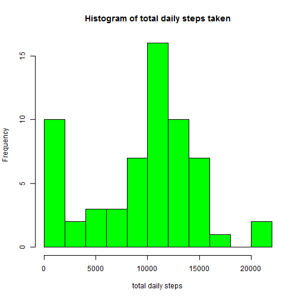
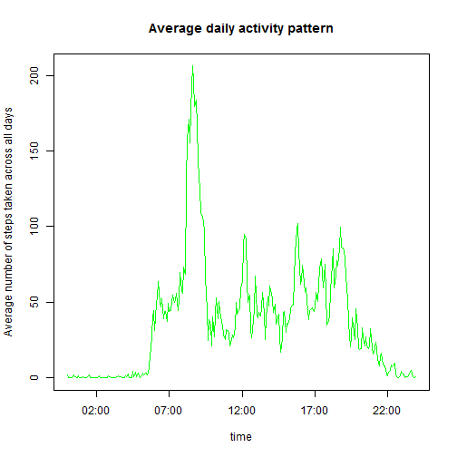
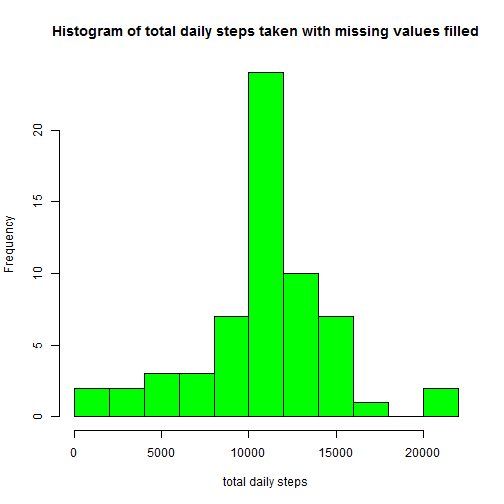
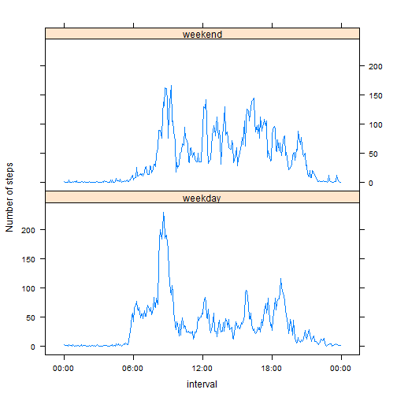

----


## Loading and preprocessing the data

A check is performed to confirm if the data file exists (*activity.csv*). If the data file could not be found, tries to unzip the zip file that contains it (*activity.zip*). Finally reads the data file and assign its content to the data frame named **dt** with the *read.csv* function.

The **date** and **interval** variables are converted to factor to help grouping in later processing.

In addition date and interval (hours/minutes) are combined in one variable named **date.time**. The observations of the variable are objects of class POSIXlt and going to be used for plotting purposes.


```r
if (!file.exists("activity.csv")) {
     if (!file.exists("activity.zip")) {
          print("Neither the data file (activity.csv) or zip file (activity.zip) exist.") ; return()
          }
     else unzip("activity.zip")
}

dt <- read.csv("activity.csv")

library(stringr)
dt$interval <- str_pad(dt$interval, 4, pad = "0")

dt$date.time <- strptime(paste(dt$date, dt$interval),
                        format = "%Y-%m-%d %H%M")

dt <- transform(dt, date = factor(date))
dt <- transform(dt, interval = factor(interval))
```


## What is mean total number of steps taken per day?

The *tapply* function is used to extract the total number of steps taken each day. The missing values in the dataset are ignored.

In the figure below the histogram of total daily steps is presented:


```r
dt_total_perday <- tapply(dt$steps, dt$date, sum, na.rm = TRUE)
hist(dt_total_perday, breaks = 15, col = "green", main = "Histogram of total daily steps taken", xlab = "total daily steps")
```

 

The **mean** and **median** of total daily steps are **9354** and **10395** respectively.

Calculation of mean:


```r
round(mean(dt_total_perday))
```

```
## [1] 9354
```

Calculation of median:


```r
round(median(dt_total_perday))
```

```
## [1] 10395
```


## What is the average daily activity pattern?

With the use of *tapply* the average number of steps taken across all days for each 5 minute interval is calculated.

A figure showing the time series plot of the result is presented below.


```r
dt_average_daily <- tapply(dt$steps, dt$interval, mean, na.rm = TRUE)

plot(dt$date.time[1:length(dt_average_daily)], dt_average_daily, type = "l", col = "green", main = "Average daily activity pattern", xlab = "time", ylab = "Average number of steps taken across all days")
```

 

The *maximum number of steps*, on average across all the days in the dataset, happens in the 5-minute interval between **08:35** and **08:40**. Calculation of interval:


```r
format(dt$date.time[which.max(dt_average_daily)], "%H:%M")
```

```
## [1] "08:35"
```

## Imputing missing values

There are number of days/intervals where there are missing values (coded as NA). The presence of missing days may introduce bias into some calculations or summaries of the data.

The *total number of missing values* in the dataset is **2304** and corresponds in about **13%** of the data. Calculation of total number of missing values:


```r
sum(is.na(dt$steps))
```

```
## [1] 2304
```

In order to minimize the influence of missing values on the analysis, a strategy for filling these voids must be adopted. The mean for each 5-minute interval calculated in the previous question is used. A replication, for each day, of this mean vector is created and the missing values in the dataset are filled with its values. The whole process is performed in a copy (new dataset named *dt_filled*) of the initial dataset *dt*.

Finally an histogram of the total number of steps taken each day after filling, as in the previous section, is made.


```r
dt_fill <- rep(dt_average_daily, length(dt_total_perday)) * is.na(dt$steps)

dt_filled <- dt
dt_filled$steps[is.na(dt$steps)] <- dt_fill[is.na(dt$steps)]

dt_total_perday_filled <- tapply(dt_filled$steps, dt$date, sum, na.rm = TRUE)
hist(dt_total_perday_filled, breaks = 15, col = "green", main = "Histogram of total daily steps taken with missing values filled", xlab = "total daily steps")
```

 

The **mean** and **median** of total daily steps, after filling of missing values, are **10766** and **10766** respectively.

Calculation of mean:


```r
round(mean(dt_total_perday_filled))
```

```
## [1] 10766
```

Calculation of median:


```r
round(median(dt_total_perday_filled))
```

```
## [1] 10766
```

The mean and median differ from the ones calculated in the first part of the assignment. After filling the missing values, the two metrics are equal which looks more natural. The filling of missing values resulted in the decrease of the histogram low level values (near zero) which appeared, in the first part, because of the interpretation of Na as zeros. This histogram appears to achieve a more clear view of the data characteristics. 

## Are there differences in activity patterns between weekdays and weekends?

Analysis is performed to investigate if activity patterns are different between weekdays and weekends. The filled-in data set created in the previous section (*dt_filled*) is used.

A new factor variable is created (two levels: weekday, weekend) and is used to group the dataset according to the 5-minute interval and weekday/weekend characteristic with the use of function *tapply*. Finally a plot is made with the use of the lattice system for the two different set of days.


```r
dt_filled$week <- "weekday"

dt_filled$week[weekdays(dt_filled$date.time) == "Saturday" | weekdays(dt_filled$date.time) == "Sunday"] <- "weekend"

dt_filled <- transform(dt_filled, week = factor(week))

dt_average_daily_2 <- tapply(dt_filled$steps, list(dt_filled$interval, dt_filled$week), mean)

dt_ad2_plot <- data.frame(steps = c(dt_average_daily_2[, 1], dt_average_daily_2[, 2]), week = gl(2, length(dt_average_daily), labels = c("weekday", "weekend")), time = dt_filled$date.time[1:length(dt_average_daily)])

library(lattice)

xyplot(steps ~ time | week, data = dt_ad2_plot, type = "l", layout = c(1, 2), xlab = "interval", ylab = "Number of steps", scales = list(x = list(format = "%H:%M")))
```

 

It is obvious that the pattern is different and some of their differences can be easily illustrated:

* The activity in weekdays starts earlier and more abrupt
* The activity in weekends looks more uniform while in weekdays has a distinctive peak during the morning hours
* The activity in weekends lasts longer at night
