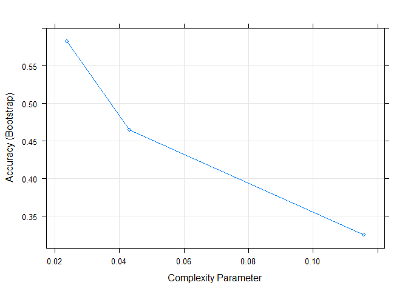
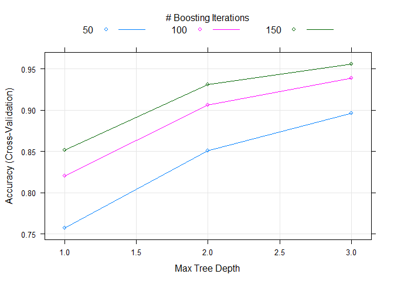
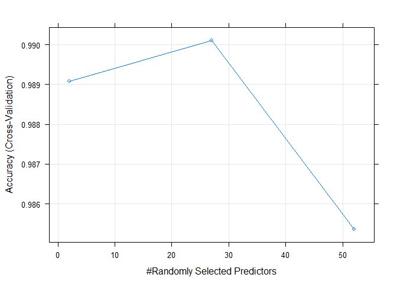
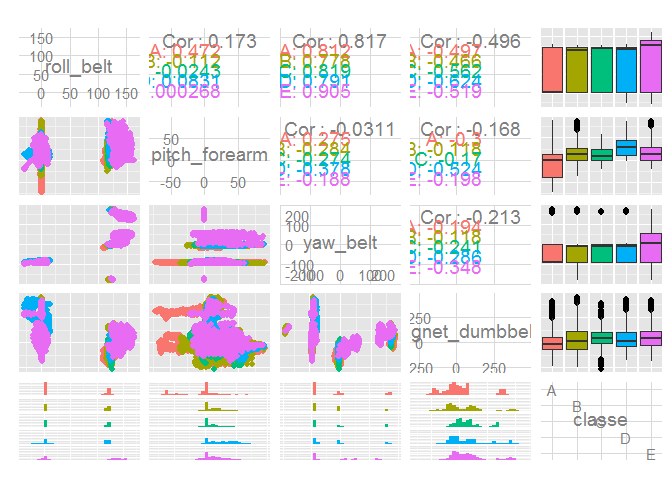

# Practical Machine Learning Course Project

## 1 Background

Using devices such as Jawbone Up, Nike FuelBand, and Fitbit it is now possible to collect a large amount of data about personal activity relatively inexpensively. These type of devices are part of the quantified self movement – a group of enthusiasts who take measurements about themselves regularly to improve their health, to find patterns in their behavior, or because they are tech geeks. One thing that people regularly do is quantify *how much* of a particular activity they do, but they rarely quantify *how well* they do it.

The goal of this project is to use data from accelerometers on the belt, forearm, arm, and dumbell of 6 participants in order to define the quality of execution. The participants in the specific study were asked to perform barbell lifts correctly and incorrectly in 5 different ways.

For further reading: [http://groupware.les.inf.puc-rio.br/har#ixzz3GfNpA0mi](http://groupware.les.inf.puc-rio.br/har#ixzz3GfNpA0mi)

## 2. Data 

The training data for this project are available here: https://d396qusza40orc.cloudfront.net/predmachlearn/pml-training.csv

The test data are available here: https://d396qusza40orc.cloudfront.net/predmachlearn/pml-testing.csv

Further information about the data can be found in http://groupware.les.inf.puc-rio.br/har#ixzz3GfOBUulI

Reference paper:

[Velloso, E.; Bulling, A.; Gellersen, H.; Ugulino, W.; Fuks, H. Qualitative Activity Recognition of Weight Lifting Exercises. Proceedings of 4th International Conference in Cooperation with SIGCHI (Augmented Human '13) . Stuttgart, Germany: ACM SIGCHI, 2013.](http://groupware.les.inf.puc-rio.br/public/papers/2013.Velloso.QAR-WLE.pdf)


```r
set.seed(123)
library(caret)
library(rpart)
library(randomForest)
library(gbm)
```


## 3. Loading datasets

The training and test datasets are downloaded if not already present in the working directory. Values "NA" and "" of variables are interpreted as not available during loading of the csv files.


```r
url1 = "https://d396qusza40orc.cloudfront.net/predmachlearn/pml-training.csv"
url2 = "https://d396qusza40orc.cloudfront.net/predmachlearn/pml-testing.csv"
file1 = "pml-training.csv"
file2 = "pml-testing.csv"

if (!file.exists(file1)) download.file(url = url1, destfile = file1)
if (!file.exists(file2)) download.file(url = url2, destfile = file2)

training <- read.csv(file1, na.strings = c("NA", ""))
testing <- read.csv(file2,  na.strings = c("NA", ""))
```

## 4. Cleaning data and pre-processing

The training data have 19622 observations of 160 variables. After a short investigation in the type (str command) and the values (summary command), which are not presented here due to length limitations, is obvious that:

* The first seven (7) variables include information about the study that is not necessary for classification
* Some of the variables have a large percentage of not available (NA) values
* Further investigation about near zero variance is needed


```r
training <- training[, -c(1:7)]
testing <- testing[, -c(1:7)]

predictors_selected <- colSums(is.na(training))/dim(training)[1] < 0.1

sum(predictors_selected)
```

```
## [1] 53
```

```r
training <- training[, predictors_selected]
testing <- testing[, predictors_selected]

sum(nearZeroVar(training, saveMetrics = TRUE)$nzv)
```

```
## [1] 0
```

The near zero variance test suggests that there are no any very low information variables, so further limitation of the finally selected variables is not performed. The final number of the explanatory variables used for classification is 52 and the variable "classe" is the response.

## 5. Data slicing and training

The initial training dataset is sliced in two sub sampled training and testing datasets. The former is used for model training and the latter for the estimation of the out of sample error of the trained classifier.

Because the training procedures are high memory and time consuming the result for each model (rpart, gbm, rf) is saved in a local file the first time that is created and loaded afterwards. The resulted fitted model is fully reproducible as *set.seed* is run before each model fitting.


```r
inTrain <- createDataPartition(y = training$classe, p = 0.7, list = FALSE)
sub_training <- training[inTrain, ]
sub_testing <- training[-inTrain, ]
```

### 5.1 Decision Tree

The first model that is used is a classification tree through the *'rpart'* package with the use of the *train* function of the *'caret'* package. The default parameter tuning procedure, with bagging 25 repetitions, of the function for the specific model is evaluated. The plot of accuracy for the different tuning parameters is presented in figure 1 (see Appendix).


```r
set.seed(1231)

if (!file.exists("modfit1.RData")) {
     modfit1 <- train(classe ~ .,
                     data = sub_training,
                     method = "rpart")
     save(modfit1, file = "modfit1.RData")
     } else load("modfit1.RData")
```

The confusion matrix of the model for the sub sampled testing dataset: 


```r
confusionMatrix(predict(modfit1, sub_testing[, -dim(training)[2]]),
                sub_testing[, dim(training)[2]])
```

```
## Confusion Matrix and Statistics
## 
##           Reference
## Prediction    A    B    C    D    E
##          A 1057  226   26   64   13
##          B  163  639   46  139  287
##          C  340  225  815  506  237
##          D  107   49  139  255   64
##          E    7    0    0    0  481
## 
## Overall Statistics
##                                         
##                Accuracy : 0.552         
##                  95% CI : (0.539, 0.565)
##     No Information Rate : 0.284         
##     P-Value [Acc > NIR] : <2e-16        
##                                         
##                   Kappa : 0.437         
##  Mcnemar's Test P-Value : <2e-16        
## 
## Statistics by Class:
## 
##                      Class: A Class: B Class: C Class: D Class: E
## Sensitivity             0.631    0.561    0.794   0.2645   0.4445
## Specificity             0.922    0.866    0.731   0.9270   0.9985
## Pos Pred Value          0.763    0.502    0.384   0.4153   0.9857
## Neg Pred Value          0.863    0.892    0.944   0.8655   0.8886
## Prevalence              0.284    0.194    0.174   0.1638   0.1839
## Detection Rate          0.180    0.109    0.138   0.0433   0.0817
## Detection Prevalence    0.236    0.216    0.361   0.1043   0.0829
## Balanced Accuracy       0.777    0.714    0.763   0.5958   0.7215
```

The accuracy and generally all the metrics of this model are low. Further investigation for an appropriate model is needed.

### 5.2 Boosting

Boosting with the *'gbm'* model is evaluated. The default tuning parameters are used and furthermore 4-fold cross-validation is defined as the resampling technique. The plot of accuracy for the different tuning parameters is presented in figure 2 (see Appendix).


```r
set.seed(1232)

if (!file.exists("modfit2.RData")) {
     modfit2 <- train(classe ~ .,
                      data = sub_training,
                      method = "gbm",
                      trControl =
                           trainControl(method = "cv",
                                        number = 4))
     save(modfit2, file = "modfit2.RData")
     } else load("modfit2.RData")
```

The confusion matrix of the model for the subs ampled testing dataset: 


```r
confusionMatrix(predict(modfit2, sub_testing[, -dim(training)[2]]),
                sub_testing[, dim(training)[2]])
```

```
## Loading required package: plyr
```

```
## Confusion Matrix and Statistics
## 
##           Reference
## Prediction    A    B    C    D    E
##          A 1651   40    0    0    5
##          B   12 1073   35    3   10
##          C    9   24  982   37    7
##          D    2    0    7  922    6
##          E    0    2    2    2 1054
## 
## Overall Statistics
##                                        
##                Accuracy : 0.966        
##                  95% CI : (0.961, 0.97)
##     No Information Rate : 0.284        
##     P-Value [Acc > NIR] : < 2e-16      
##                                        
##                   Kappa : 0.956        
##  Mcnemar's Test P-Value : 1.92e-10     
## 
## Statistics by Class:
## 
##                      Class: A Class: B Class: C Class: D Class: E
## Sensitivity             0.986    0.942    0.957    0.956    0.974
## Specificity             0.989    0.987    0.984    0.997    0.999
## Pos Pred Value          0.973    0.947    0.927    0.984    0.994
## Neg Pred Value          0.995    0.986    0.991    0.992    0.994
## Prevalence              0.284    0.194    0.174    0.164    0.184
## Detection Rate          0.281    0.182    0.167    0.157    0.179
## Detection Prevalence    0.288    0.193    0.180    0.159    0.180
## Balanced Accuracy       0.988    0.965    0.971    0.977    0.986
```

All the metrics of the model are satisfactory.

### 5.3 Random Forests

Random forests with the *'rf'* model is evaluated. The default tuning parameters are used and furthermore 4-fold cross-validation is defined as the resampling technique. The plot of accuracy for the different tuning parameters is presented in figure 3 (see Appendix).


```r
set.seed(1233)

if (!file.exists("modfit3.RData")) {
     modfit3 <- train(classe ~ .,
                      data = sub_training,
                      method = "rf",
                      trControl =
                           trainControl(method = "cv",
                                        number = 4))
     save(modfit3, file = "modfit3.RData")
     } else load("modfit3.RData")
```

The confusion matrix of the model for the sub sampled testing dataset: 


```r
confusionMatrix(predict(modfit3, sub_testing[, -dim(training)[2]]),
                sub_testing[, dim(training)[2]])
```

```
## Confusion Matrix and Statistics
## 
##           Reference
## Prediction    A    B    C    D    E
##          A 1674    3    0    0    0
##          B    0 1136    3    0    0
##          C    0    0 1023   11    0
##          D    0    0    0  953    2
##          E    0    0    0    0 1080
## 
## Overall Statistics
##                                         
##                Accuracy : 0.997         
##                  95% CI : (0.995, 0.998)
##     No Information Rate : 0.284         
##     P-Value [Acc > NIR] : <2e-16        
##                                         
##                   Kappa : 0.996         
##  Mcnemar's Test P-Value : NA            
## 
## Statistics by Class:
## 
##                      Class: A Class: B Class: C Class: D Class: E
## Sensitivity             1.000    0.997    0.997    0.989    0.998
## Specificity             0.999    0.999    0.998    1.000    1.000
## Pos Pred Value          0.998    0.997    0.989    0.998    1.000
## Neg Pred Value          1.000    0.999    0.999    0.998    1.000
## Prevalence              0.284    0.194    0.174    0.164    0.184
## Detection Rate          0.284    0.193    0.174    0.162    0.184
## Detection Prevalence    0.285    0.194    0.176    0.162    0.184
## Balanced Accuracy       1.000    0.998    0.997    0.994    0.999
```

All the metrics of the model are satisfactory and superior to the boosting method. After the fitting of the random forest model, information is extracted about the importance of variables. A pair plot of the four  most important variables is presented in figure 5 (see Appendix).

##6. Prediction with the initial testing dataset

The initial testing dataset is a small set of 20 observations and the class is not known. The same cleaning and pre-processing procedures were also applied and the classes can be predicted with the three models that were evaluated:


```r
predict(modfit1, testing[, -dim(training)[2]]) # Predicting with Trees (rpart)
```

```
##  [1] D C A C B C C C A A C C B A C B D C D B
## Levels: A B C D E
```

```r
predict(modfit2, testing[, -dim(training)[2]]) # Predicting with Boosting (gbm)
```

```
##  [1] B A B A A E D B A A B C B A E E A B B B
## Levels: A B C D E
```

```r
predict(modfit3, testing[, -dim(training)[2]]) # Predicting with Random Forests (rf)
```

```
##  [1] B A B A A E D B A A B C B A E E A B B B
## Levels: A B C D E
```

The results of boosting and random forests are the same but the decision tree estimate is very far. The random forest prediction is used to the automatic submission part of the project.

## Appendix


```r
plot(modfit1)
```

 

**Figure 1. Accuracy of the model (rpart) for the different complexity parameters that are used during tuning**


```r
plot(modfit2)
```

 

**Figure 2. Accuracy of the model (gbm) for the two different parameters (maximum tree depth and boosting iterations) that are used during tuning**


```r
plot(modfit3)
```

 

**Figure 3. Accuracy of the model for the different parameter values (randomly selected predictors) that are used during tuning**


```r
vars <- varImp(modfit3)

library(GGally)
ggpairs(data = sub_training,
        columns = c(rownames(vars$importance)[
             order(vars$importance, decreasing = TRUE)][1:4],
             "classe"),
        colour = "classe")
```

 

**Figure 4. Pair plotting of the 4 most important variables according to the random forest model.**
